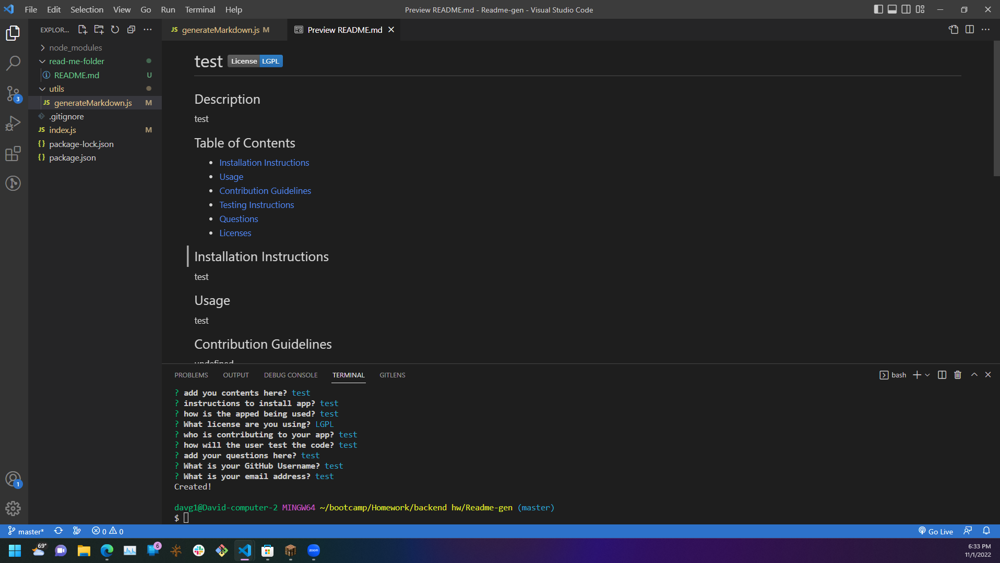

# Readme-gen

## User Story
```md
As a user As a user i want to be able to create a professional automatically
```

## Summary:
To allow users an easir way to to create a professional automatic generated ReadME.

## Screen Shot Demo


## Links:

link to the deployed vedio: https://www.youtube.com/watch?v=784BvxaRCNY

link to github page: https://github.com/Davg1700/Readme-gen
